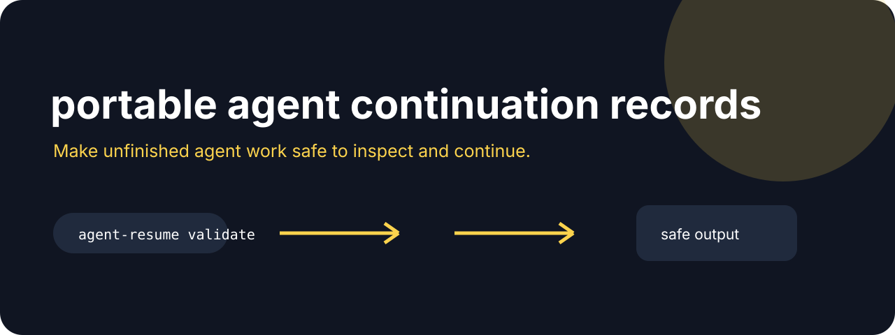

# Agent Resume



**Make unfinished agent work safe to inspect and continue.**

[](https://github.com/jonah-ux/agent-resume/actions/workflows/ci.yml)
[](https://www.python.org/)
[](LICENSE)

Agent Resume stores the small set of facts a new agent needs to continue work: the goal,
repository, branch, commit, completed steps, pending steps, evidence, and unknowns. It binds
those fields to a canonical SHA-256 fingerprint and can compare two records without printing
their evidence contents.

## Try it in 30 seconds

This repository works on its own. Its fixtures, CLI, and demo require no other Jonah-UX repository.
Companion links below are optional ideas for connecting outputs after the default workflow works.

```bash
git clone --depth 1 https://github.com/jonah-ux/agent-resume.git
cd agent-resume
python3 -m venv .venv
. .venv/bin/activate
python3 -m pip install .
python3 demos/demo.py
```

Create and validate a continuation record:

```bash
agent-resume create --out previous-resume.json --goal "ship demo" --repository . --branch main --commit "$(git rev-parse HEAD)"
agent-resume create --out resume.json --goal "ship demo" --repository . --branch main --commit "$(git rev-parse HEAD)"
agent-resume validate resume.json --require-fingerprint
agent-resume inspect resume.json --require-fingerprint
agent-resume diff resume.json --against previous-resume.json --require-fingerprint
```

## See it work

Validation fails closed when identity or integrity is missing. The `diff` envelope includes the
current and baseline input paths and whole-record fingerprints. Each `changed[]` entry contains
only the changed field name and baseline/current SHA-256 digests, so a reviewer can compare
handoffs without copying the evidence text:

```json
{"schema":"agent-resume/validation/v1","ok":true,"integrity":"verified","fingerprint":"..."}
```

Open the [continuation and diff walkthrough](docs/walkthrough.html) for a visual tour of the
handoff fields, validation gate, and changed-field readback. The browser board is illustrative;
it does not invoke `agent-resume` or inspect a repository.

## Related tools

Use [Agent Proof](https://github.com/jonah-ux/agent-proof) to attach evidence, [Chatlens](https://github.com/jonah-ux/chatlens) to recover the missing conversation, and [Worktree Conservator](https://github.com/jonah-ux/worktree-conservator) to keep the repository state recoverable.

Validation requires a goal, repository identity, and commit so a handoff cannot quietly lose
which source state it describes. The record uses the `agent-resume/v1` schema; `diff` uses
`agent-resume/diff/v1` and is exit 1 when two valid records differ.

Validation also rejects unsupported top-level fields and non-string list members. A record with
malformed shape is reported with `integrity: "invalid"` and cannot be treated as a verified
fingerprinted handoff.

## Development

```bash
python3 -m unittest discover -s tests
python3 -m build --sdist --wheel
```

A resume file is a handoff aid. Re-check the repository and runtime before claiming the work is
complete.

## Public surface audit

Run `python3 scripts/audit_public_surface.py --json` from a clean checkout. The receipt checks
dependency and license declarations, release-workflow provenance markers, and high-signal secret
patterns across tracked text files. Pass `--dist-dir dist` to compare wheel and sdist bytes with
`SHA256SUMS`; missing artifacts remain `unavailable`.

MIT licensed.
